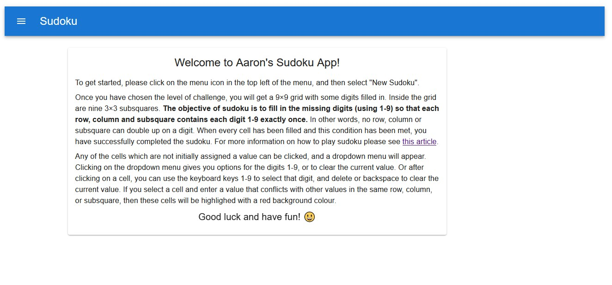
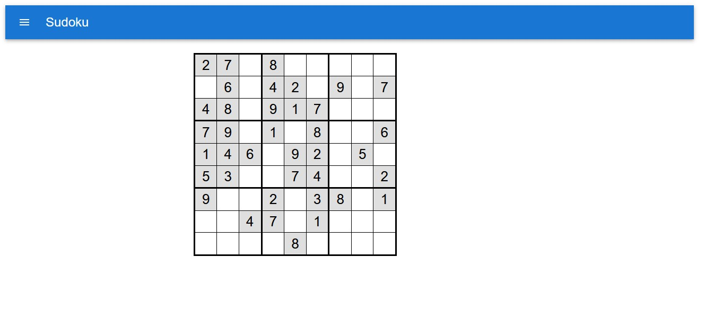
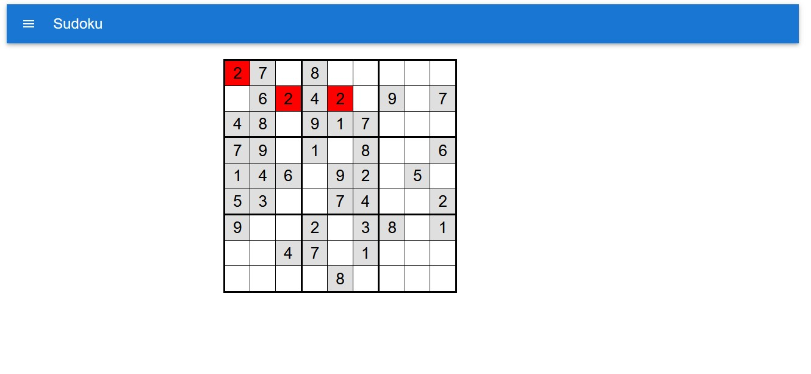

# Sudoku App

This is a single page web application which allows users to play sudoku. Who doesn't enjoy solving a sudoku every so often...

The live version of the application is [here](https://aarons-sudoku.netlify.app/).

It is somewhat of a work in progress. I plan to add extra functionality and features as time allows.

## Overview

When users first visit the site, they are greeted with the following welcome message and instructions:


After selecting 'New Game' from the menu and selecting a level of difficulty, the screen will change and display their puzzle in a grid. An example of this is below:


Users can then click on cells (other than the initial cells with values assigned at the start of the game) and set values for those cells to complete the sudoku. If there are any cells with conflicts (i.e. cells in the same row, column or subsquare having the same value), these get highlighted with a red background as below:


## Tech stack

This app is written in JS.

Some of the key modules used in this project are:
1. React and Redux - for the front-end
1. Material UI - for components used on the front-end
1. Express (Node.js) - for the server
1. [sudoku-gen](https://www.npmjs.com/package/sudoku-gen) - for the sudoku puzzle generation

## App structure

The app consists of the MenuAppBar, SnackMessage, and NewSudokuModal components as well as the SudokuGrid component - which is where most of the action happens.

The SudokuGrid is a 9 x 9 table consisting of Cell components. Each Cell has some associated state and represents a position in the SudokuGrid which can be set to a value (between 1 and 9). If a Cell is part of the initial values for that Sudoku puzzle, then it is not clickable, all other Cells are clickable and can be assigned a value by selecting from the dropdown list or via pressing a number key on the keyboard. When a Cell has a number entered or changed this is checked with all other Cells in the same row, column, or 3 x 3 subsquare and if that number appears anywhere else the Cells with conflicts are highlighted with a red background colour.

The Sudoku is successfully completed when: all Cells have a value assigned, and there are no conflicts (i.e. no Cells in the same row, column, or 3 x 3 subsquare have the same value). When this happens a short success message ("✔ Sudoku successfully completed! ✔") is displayed to the user in the SnackMessage component.

## Sudoku puzzle generation

I use the module [sudoku-gen](https://www.npmjs.com/package/sudoku-gen) for puzzle generation. I have a function `getPuzzle` which takes a difficulty parameter. sudoku-gen is used to generate the puzzle of the required difficulty and the function then returns the resulting puzzle, represented as a string of 81 digits (with 0's used to represent blank Cells).

As an example, the function call:
```
getPuzzle("easy")
```
might return the following string:
```
"009030000800000305000502680480927501910000020730085496500000060204051000008309004"
```
